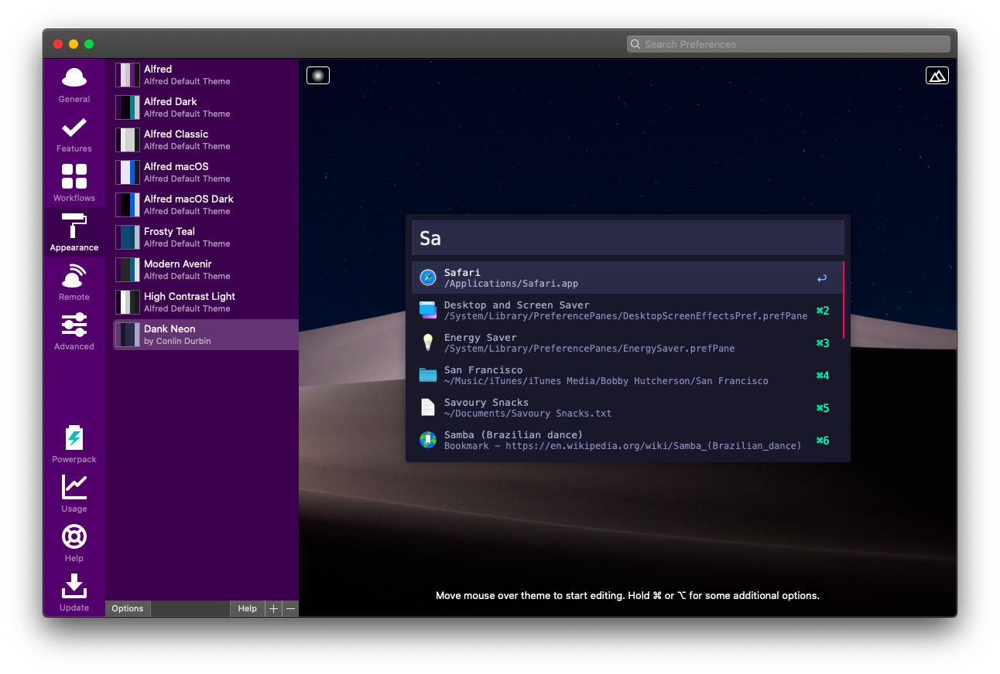

# Dank Neon for Alfred

> A danker, more neon theme for [Alfred](https://alfredapp.com)

## Installation

From Github
1. You can download the files directly by cloning this repo or downloading the zip.
2. Unpackage your zip.
3. Open Alfred > Preferences > Appearance
4. Drag `Dank Neon.alfredappearance` to the theme side panel.

Directly from Alfred
[Available Here](https://www.alfredapp.com/extras/theme/4absTV9zy3/)

*You need the [Powerpack](https://www.alfredapp.com/powerpack/) for custom themes.*

## Contributing

[MIT License](/LICENSE)
